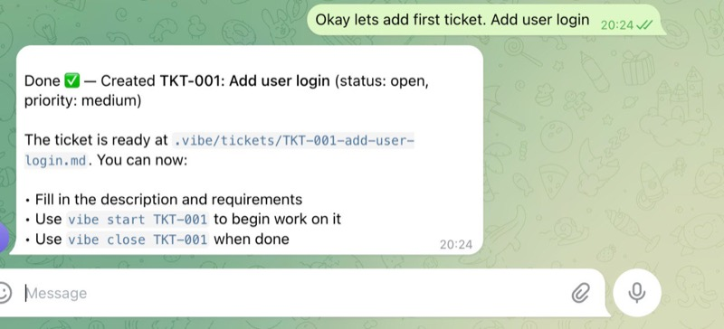
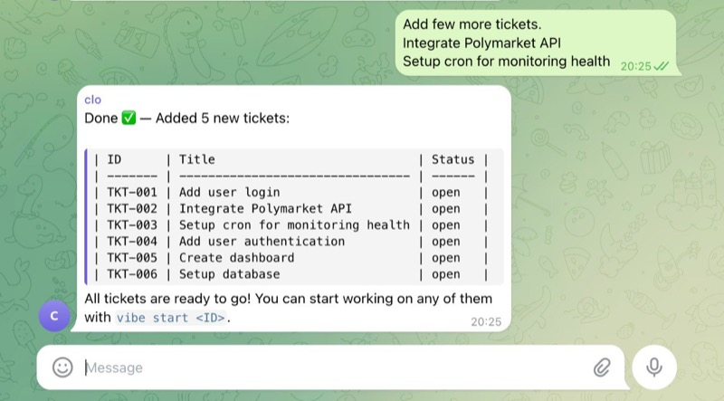
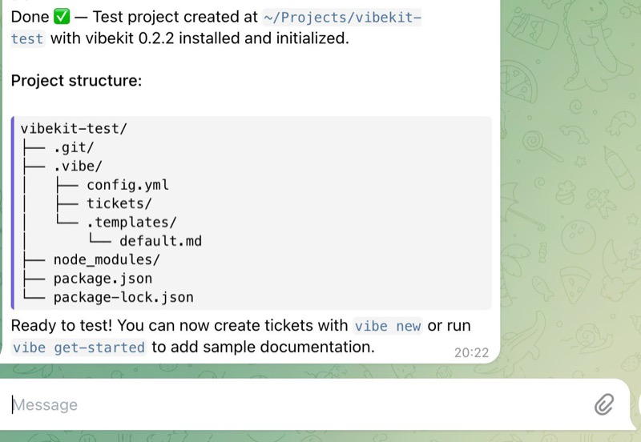

## Description

Document how VibeKit integrates with OpenClaw for autonomous AI-assisted project management. This use case demonstrates using VibeKit tickets with OpenClaw agents (Opus, Haiku, etc.) to manage project workflows, spawn sub-agents, and track progress through the CLI.

### Overview
VibeKit + OpenClaw enables:
- AI-powered ticket creation and management
- Automated agent task delegation (spawn Opus to work on TKT-001, TKT-002, etc.)
- Real-time ticket status tracking
- Git branch management tied to tickets
- Seamless collaboration between human users and AI agents

### Screenshots
1. **Creating First Ticket** - `vibe new "Add user login"` creates TKT-001
   

2. **Batch Ticket Creation** - Multiple tickets created with descriptions
   

3. **Project Structure** - VibeKit initialization and structure
   

## Acceptance Criteria

- [x] Create comprehensive documentation in `docs/openclaw-use-case/` folder
- [x] Include all three reference screenshots (optimized for web)
- [x] Document the workflow: create tickets → start work → dispatch to agents → update status → close
- [x] Add example CLI commands for common VibeKit + OpenClaw flows
- [x] Document how `vibe start` and `vibe close` integrate with git branches
- [x] Add section on spawning agents (e.g., `sessions_spawn` with Opus for TKT-001, TKT-002)
- [x] Create a README.md in docs/openclaw-use-case with quickstart guide

## Implementation Notes

- VibeKit v0.2.2 released with full support for ticket management
- OpenClaw agents can be spawned via `sessions_spawn()` API
- Each ticket auto-creates a git branch (e.g., TKT-001-add-user-login)
- Ticket status flow: open → in_progress → review → done
- Use `vibe list` to show all tickets with statuses
- Integration tested on ~/Projects/vibekit-test project
- Images optimized to 57-75 KB each for minimal npm bundle impact
- Images excluded from npm via `files` whitelist in package.json

## Design / UX Considerations

- Use visuals (screenshots) to make the guide accessible
- Keep the guide focused on the AI-agent workflow, not just basic VibeKit usage
- Include practical copy-paste commands for quick adoption
- Reference OpenClaw documentation where appropriate

## Testing & Test Cases

- [x] Created test project (~/Projects/vibekit-test)
- [x] Created 6 tickets (TKT-001 through TKT-006)
- [x] Tested `vibe start` and status transitions
- [x] Verified images display correctly in markdown
- [x] Confirmed images are small enough for npm bundle

## AI Workflow

<!-- NOTE (Do not remove) -->
Completed through manual documentation creation and screenshots from test project workflow.
