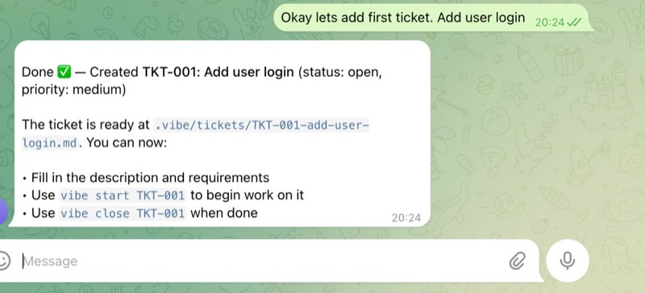

```
╭─────────────────────────────────────────────────────────────────╮
│                                                                 │
│   ██╗   ██╗██╗██████╗ ███████╗    ██╗  ██╗██╗████████╗        │
│   ██║   ██║██║██╔══██╗██╔════╝    ██║ ██╔╝██║╚══██╔══╝        │
│   ██║   ██║██║██████╔╝█████╗      █████╔╝ ██║   ██║           │
│   ╚██╗ ██╔╝██║██╔══██╗██╔══╝      ██╔═██╗ ██║   ██║           │
│    ╚████╔╝ ██║██████╔╝███████╗    ██║  ██╗██║   ██║           │
│     ╚═══╝  ╚═╝╚═════╝ ╚══════╝    ╚═╝  ╚═╝╚═╝   ╚═╝           │
│                                                                 │
╰─────────────────────────────────────────────────────────────────╯
```

<div align="center">

[](https://www.npmjs.com/package/@vibedx/vibekit)
[](https://www.npmjs.com/package/@vibedx/vibekit)
[](https://github.com/vibedx/vibekit/blob/main/LICENSE)

**A CLI tool to help you vibe your code better** ✨  
*Vibe your development workflow*  
_vibekit uses vibekit to develop vibekit - we vibin!_ 🔄

</div>

---

## 🚀 Quick Start

```bash
# Install globally
npm install -g @vibedx/vibekit

# Initialize in your project
vibe init

# Create your first ticket
vibe new "Add user authentication"

# Start working on it
vibe start TKT-001
```

### 🤖 Use with AI Agents (skills.sh)

Install the vibekit skill so AI coding agents (Claude Code, Cursor, Codex, etc.) know how to use it:

```bash
npx skills add vibedx/vibekit
```

The skill teaches agents the ticket-driven workflow — they'll create focused tickets before writing code, track work through git branches, and keep tickets as living documentation.

**Coordinating multiple agents?** See **[docs/agent-workflow.md](./docs/agent-workflow.md)** for a framework-agnostic pattern for running multi-agent teams on a shared repo — assignees, polling loops, escalation, and loop prevention.

## 🤔 Why VibeKit?

- **🎯 Vibe code with manageable smaller tasks** - Break down complex features into focused tickets
- **🎮 Stay in control** - You drive the development, AI assists with structure and clarity
- **🧠 Less model hallucination** - Clear, scoped tickets reduce AI confusion and improve accuracy
- **📚 Develop docs as you go** - Maintain work history and context with every ticket
- **🔍 Let models vibe review** - AI can review your work against the original ticket requirements
- **🚀 AI-native ticket management** - Purpose-built for AI-assisted development workflows
- **⚡ Generate tickets using Claude Code and Codex power** - Leverage cutting-edge AI for planning
- **🔄 Seamless git workflow** - Automatic branch creation and status tracking
- **🌿 Parallel worktrees** - Work on multiple tickets simultaneously with `--worktree`
- **📝 Living documentation** - Your tickets in git become your project's development story

## ✨ Features

```
   🎯 Smart Ticket Management    📋 Interactive Lists & Filters
   🔗 Git Branch Integration     🤖 AI-Powered Enhancement (Claude Code / Codex)
   📝 Customizable Templates     🔍 Quality Validation & Auto-Fix
```

- **🎯 Smart Tickets**: Create, manage, and track development tickets with unique IDs
- **🔗 Git Integration**: Automatic branch creation and workflow management
- **🌿 Worktree Support**: Work on multiple tickets in parallel without switching branches
- **🤖 AI Enhancement**: Claude Code integration for ticket refinement and content improvement
- **📋 Interactive CLI**: Beautiful terminal interface with arrow navigation
- **📝 Templates**: Customizable ticket templates for consistent workflows
- **🔍 Quality Control**: Automated linting and validation with auto-fix capabilities
- **🚀 Quick Actions**: One-command ticket creation, status updates, and more

## 📚 Commands Reference

### 🏗️ Project Setup
```bash
# Initialize VibeKit in your project
vibe init [--with-samples|-s]

# Get started with sample tickets and guide
vibe get-started
```

### 🎫 Ticket Management
```bash
# Create a new ticket
vibe new "Fix login bug"
vibe new "Add dark mode" --priority high --assignee alice
vibe new "Quick task" --assignee bob -n   # -n skips AI prompt

# List all tickets (with optional filtering)
vibe list
vibe list --status=open
vibe list --assignee=alice

# Check active worktrees and ticket progress
vibe status

# Close/complete a ticket
vibe close TKT-001

# Start working on a ticket (creates git branch)
vibe start TKT-001
vibe start TKT-001 --base main --update-status

# Start in a separate worktree (parallel work without switching branches)
vibe start TKT-001 --worktree
vibe start TKT-001 -w

# Spawn a Claude agent to work on a ticket automatically
vibe start TKT-001 --agent                  # Single ticket, current directory
vibe start TKT-001 TKT-002 -w --agent       # Multiple tickets in worktrees with agents
```

### 👥 Team Management
```bash
# List team members
vibe team

# Add a member (stored in .vibe/team.yml)
vibe team add alice --name "Alice" --github alice --slack U0ABC123 --role Engineer
vibe team add bob --name "Bob" --github bob --slack U0DEF456 --role Designer

# Show a member's details
vibe team show alice

# Remove a member
vibe team remove old-member
```

### 🤖 AI Integration
```bash
# Connect Claude Code for ticket enhancement
vibe link

# Enhance a ticket using Claude with AI
vibe refine TKT-001

# Interactive refinement with custom goals
vibe refine TKT-005 "focus on performance and error handling"

# Disconnect AI integration
vibe unlink
```

### 🔍 Quality & Validation
```bash
# Validate ticket documentation formatting
vibe lint

# Lint with detailed output including warnings
vibe lint --verbose

# Automatically fix missing frontmatter fields and sections
vibe lint --fix

# Lint a specific ticket file
vibe lint TKT-001-example.md
```

## 🛠️ Usage Examples

### Creating Your First Workflow
```bash
# 1. Initialize your project
$ vibe init --with-samples
✅ Created .vibe directory structure
📝 Added sample tickets and templates

# 2. Create a new feature ticket
$ vibe new "Add dark mode toggle" --priority high
🎫 Created TKT-004: Add dark mode toggle
🤖 Want to enhance with AI? (y/n) y

# 3. Start working on it
$ vibe start TKT-004
🌿 Created branch: feature/TKT-004-add-dark-mode-toggle
📝 Updated ticket status to in_progress

# 4. Check your progress
$ vibe list
┌─────────┬──────────────┬─────────────────────────────┐
│ ID      │ Status       │ Title                       │
├─────────┼──────────────┼─────────────────────────────┤
│ TKT-004 │ in_progress  │ Add dark mode toggle        │
│ TKT-003 │ open         │ Fix responsive layout       │
│ TKT-002 │ done         │ Setup authentication        │
└─────────┴──────────────┴─────────────────────────────┘
```

### Working with AI Enhancement
```bash
# Connect Claude Code (one-time setup)
$ vibe link
🔗 Configure Claude Code integration
✨ Enter your API key: [hidden]
✅ AI features enabled!

# Claude will automatically enhance new tickets
$ vibe new "Optimize database queries"
🎫 Created TKT-005: Optimize database queries
🤖 Enhancing using Claude...
✨ Added acceptance criteria, technical details, and test plan!

# Or refine existing tickets with AI
$ vibe refine TKT-003
▶ Analyzing ticket TKT-003...
ℹ Found: TKT-003 - Fix responsive layout
🧠 Analyzing ticket content...
✨ Generating enhancements...

🔧 Refinement Options
❯ Apply refinements to ticket
  Ask for changes/improvements  
  View diff in terminal
  Cancel and exit

# View what Claude enhanced before applying
📊 TICKET REFINEMENT DIFF
═══════════════════════════════════════
🔹 Title (refined):
────────────────────────────────────────
Fix responsive layout issues in `src/components/Layout.jsx`

🔹 Implementation Notes (refined):
────────────────────────────────────────
- Update CSS Grid in `src/styles/layout.css` for mobile breakpoints
- Add `useMediaQuery()` hook for responsive state management
- Test on devices: iPhone SE, iPad, desktop (1920px+)
```

### Working with Worktrees (Parallel Development)
```bash
# Start a ticket in its own worktree
$ vibe start TKT-005 --worktree
🌿 Created worktree at ~/.vibekit/worktrees/myproject/feature--TKT-005-add-api-cache/
📝 Updated ticket status to in_progress
💡 cd ~/.vibekit/worktrees/myproject/feature--TKT-005-add-api-cache/
💡 Run npm install in the worktree if needed

# Your main branch stays untouched — work on TKT-005 in the worktree
# List tickets shows worktree indicator
$ vibe list
┌─────────┬──────────────┬─────────────────────────────┬──────────┐
│ ID      │ Status       │ Title                       │ Worktree │
├─────────┼──────────────┼─────────────────────────────┼──────────┤
│ TKT-005 │ in_progress  │ Add API cache               │ 🌿       │
│ TKT-004 │ in_progress  │ Add dark mode toggle        │          │
└─────────┴──────────────┴─────────────────────────────┴──────────┘

# Close removes the worktree automatically
$ vibe close TKT-005
🗑️  Removed worktree at ~/.vibekit/worktrees/myproject/feature--TKT-005-add-api-cache/
✅ Closed TKT-005
```

### Autonomous Development with Claude Agents
```bash
# Spawn a Claude agent to work on a single ticket
$ vibe start TKT-006 --agent
🤖 Starting Claude agent for TKT-006...
⏱️  Agent timeout: 15 minutes (configurable in .vibe/config.yml)
✨ Agent has full tool access (git, file I/O, CLI)

# Agent automatically:
• Creates the branch and updates ticket to in_progress
• Reads ticket requirements and implements the work
• Commits changes with clear commit messages
• Marks ticket as done when complete (or in_progress if changes needed)

# Work on multiple tickets with agents in parallel worktrees
$ vibe start TKT-006 TKT-007 TKT-008 -w --agent
🌿 Creating 3 worktrees with Claude agents...
🤖 Agent 1 working on TKT-006
🤖 Agent 2 working on TKT-007
🤖 Agent 3 working on TKT-008

# Monitor progress
$ vibe status
Active Worktrees:
  🌿 feature/TKT-006-... (TKT-006: in_progress) 🤖 Agent running...
  🌿 feature/TKT-007-... (TKT-007: in_progress) 🤖 Agent running...
  🌿 feature/TKT-008-... (TKT-008: in_progress) 🤖 Agent running...
```

### Agent Configuration
```yaml
# In .vibe/config.yml
worktree:
  agent:
    timeout: 900  # 15 minutes (seconds), increase for complex work
```

### Quality Control with Lint
```bash
# Check all tickets for formatting issues
$ vibe lint
🔍 VibeKit Ticket Linter Results

❌ TKT-001-setup.md
   Error: Missing required frontmatter field: slug
   Error: Missing required section: ## Implementation Notes

❌ TKT-003-responsive.md
   Error: Invalid status "in-review". Must be one of: open, in_progress, review, done
   Error: Section "## Testing & Test Cases" appears to be empty or too short

✅ TKT-002-auth.md

📊 Summary:
   Files checked: 3
   Files with issues: 2
   Total errors: 4
   Total warnings: 0

💡 Fix the errors above to ensure consistent ticket formatting.
💡 Use --fix flag to automatically fix missing sections.

# Automatically fix missing fields and sections
$ vibe lint --fix
🔍 VibeKit Ticket Linter Results

🔧 TKT-001-setup.md (FIXED)
   Fixed: 1 missing frontmatter fields and 3 missing sections

❌ TKT-003-responsive.md
   Error: Invalid status "in-review". Must be one of: open, in_progress, review, done

📊 Summary:
   Files checked: 3
   Files with issues: 1
   Files fixed: 1
   Total errors: 1
   Total warnings: 1

🎉 Most issues have been fixed! Please review and fix remaining errors manually.
```

### 🦀 OpenClaw Integration - Autonomous Workflow Management

Your bot automatically understands VibeKit. Just ask it to get started:

> "Set up this project with @vibedx/vibekit, add tickets for the features we need, and start working on them."

The bot will:
- Install & initialize VibeKit automatically
- Create tickets from your requirements
- Work on tickets, update progress, close when done
- Use `vibe list` to track and manage the workflow
- Keep all context in tickets — never loses progress between chats

**What you can ask your bot to:**
- 📝 **Add tickets** - "Create tickets for user auth, database setup, API integration"
- ✏️ **Refine tickets** - "Update TKT-003 with better acceptance criteria"
- 🗑️ **Remove tickets** - "Delete TKT-005, we don't need that anymore"
- 🔍 **Check progress** - "What's done? What's in progress? Show me the summary"
- 🚀 **Keep working** - "Continue where we left off, here's what I want next"

**Why this works:**
- 🎯 **Bot understands scope** - Tickets define clear, focused work
- 🔍 **Full visibility** - You see exactly what the bot did in git history
- 🎮 **Stay in control** - Ask to pause, change direction, review anytime
- 📋 **Never restart** - Context lives in `.vibe/tickets/` — survives token limits

**📚 [Full Guide & Examples →](./docs/openclaw-use-case/OPENCLAW_INTEGRATION.md)** | **[TKT-018](/.vibe/tickets/TKT-018-add-openclaw-integration-documentation.md)** for details



## ⚙️ Configuration

VibeKit creates a `.vibe` directory in your project root:

```
📁 .vibe/
  ├── 📋 config.yml           # Main configuration
  ├── 👥 team.yml             # Team members (GitHub, Slack, X handles)
  ├── 📁 .templates/          # Ticket templates
  │   └── 📄 default.md       # Default ticket template
  ├── 📁 tickets/             # Your ticket files
  │   ├── 🎫 TKT-001-setup.md
  │   └── 🎫 TKT-002-auth.md
  └── 📄 README.md           # Project guidance
```

### Sample config.yml
```yaml
# Project settings
project:
  name: vibekit
  description: CLI tool for managing tickets, project context, and AI suggestions

# Ticket settings
tickets:
  path: .vibe/tickets
  id_format: TKT-{number}
  default_template: .vibe/.templates/default.md
  use_status_folders: false
  slug:
    max_length: 30
    word_limit: 5
  status_options:
    - open
    - in_progress
    - review
    - done
  priority_options:
    - low
    - medium
    - high
    - critical

# Team (stored in separate file for large teams)
team:
  path: .vibe/team.yml

# AI integration
ai:
  enabled: true

# Git integration
git:
  branch_prefix: feature/
  default_base: main
  worktrees_path: ~/.vibekit/worktrees  # Where worktrees are created

# Hooks
hooks:
  pre_commit: false
  post_checkout: false
```

## 🤝 Contributing & Feedback

We'd love your help making VibeKit better! Here's how you can contribute:

- 🐛 **Report bugs** → [GitHub Issues](https://github.com/vibedx/vibekit/issues)
- 💡 **Suggest features** → [Discussions](https://github.com/vibedx/vibekit/discussions)  
- 🔧 **Submit PRs** → [Contributing Guide](https://github.com/vibedx/vibekit/blob/main/CONTRIBUTING.md)
- ⭐ **Star the repo** → Show your support!

### Development Setup
```bash
git clone https://github.com/vibedx/vibekit.git
cd vibekit
npm install
npm start  # Watch mode
```

## 👥 Contributors

<div align="center">

*Thank you to everyone who helps make VibeKit better!*

*Want to see your name here? [Contribute to the project!](https://github.com/vibedx/vibekit/blob/main/CONTRIBUTING.md)*

</div>

## Release Preparation

### Prerequisites
- [ ] NPM account with publish permissions
- [ ] All features tested and working
- [ ] Documentation updated
- [ ] CHANGELOG.md updated (if applicable)

### Release Steps
1. **Test the build**: `npm start` to verify everything works
2. **Version bump**: 
   - Patch: `npm version patch` (bug fixes)
   - Minor: `npm version minor` (new features)
   - Major: `npm version major` (breaking changes)
3. **Publish**: `npm publish --access=public` (for scoped packages)
4. **Verify**: `npm info @vibedx/vibekit` to confirm publication

### Pre-Release Checklist
- [ ] All commands work as expected
- [ ] No sensitive data in published files
- [ ] Package.json metadata is correct
- [ ] README reflects current functionality
- [ ] Version number follows semantic versioning

## Contributing

1. Fork the repository
2. Create your feature branch
3. Commit your changes
4. Push to the branch
5. Create a Pull Request

## License

MIT
